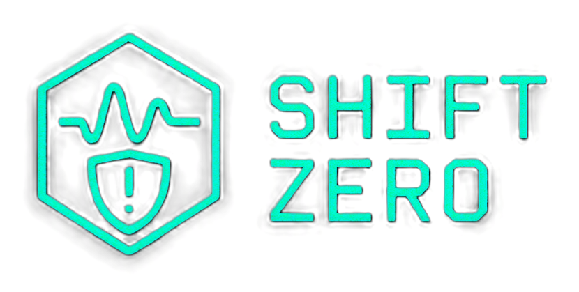
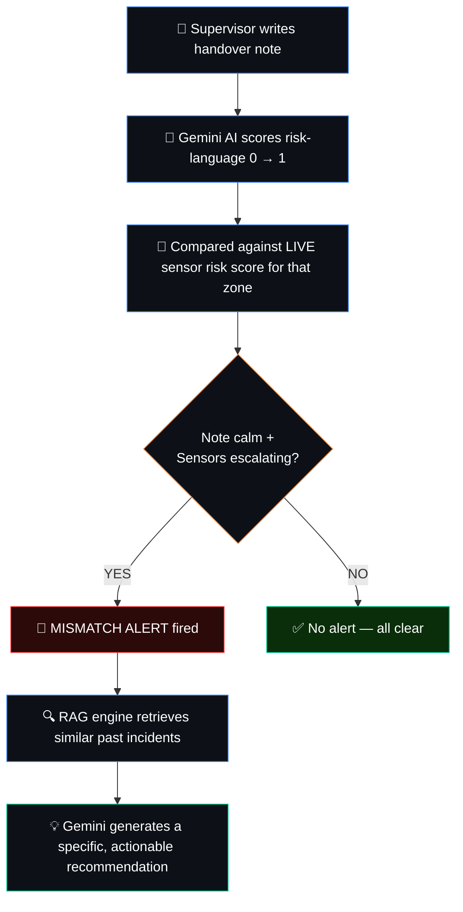
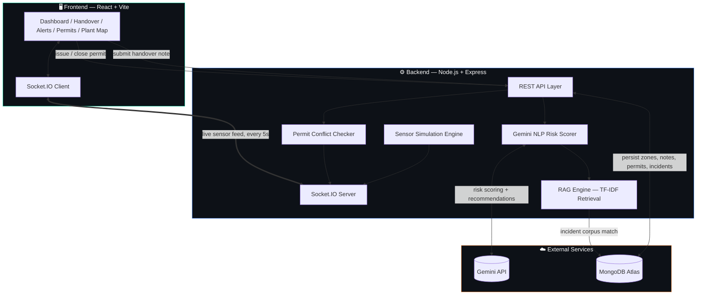
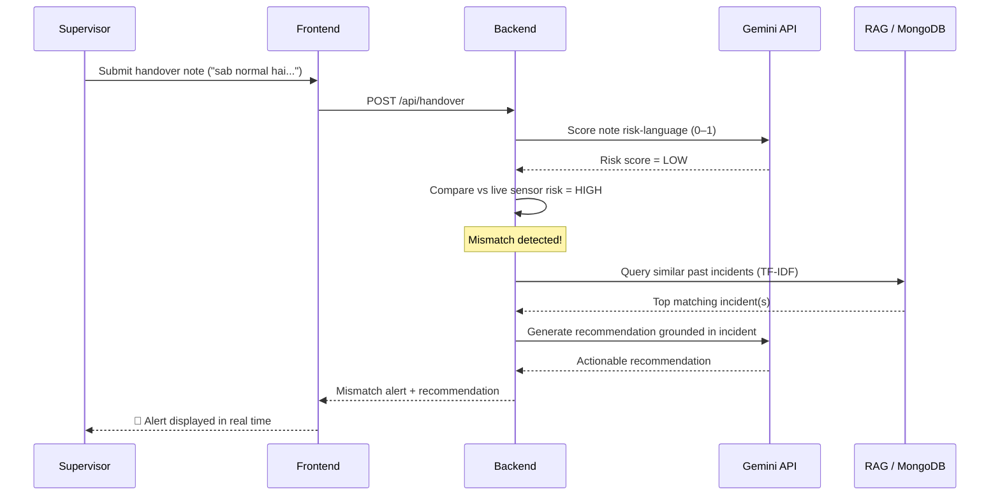
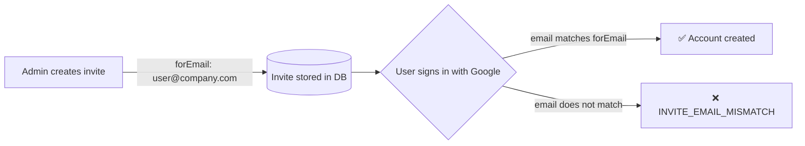

<div align="center">



### AI-Powered Industrial Safety Intelligence Platform
**Verbal-Sensor Mismatch Intelligence Platform**

[](https://shiftzero-industrial-safety.vercel.app)

<br/>


</div>

---

## 🚨 The Problem

> **6,500+ fatal industrial accidents** occur in India every year ([DGFASLI](https://dgfasli.gov.in)).
> A disproportionate number happen **within 2 hours of shift changeover.**

The root cause isn't always equipment failure — it's a **communication failure**:

> *"Sab normal hai, routine hai, will check later..."*

The outgoing supervisor says **everything is fine**, while the **sensors are already screaming otherwise.**

**Shift Zero exists to close this exact gap** — between what humans *say* and what machines *measure* — in the critical 10-minute window when a fatal accident can be prevented.

---

## 💡 What Shift Zero Does

### Core Innovation: Verbal-Sensor Mismatch Detection



In parallel, **Permit-to-Work data is cross-checked against live sensors** — e.g. a Hot Work permit active in a zone where gas concentration has crossed a danger threshold triggers an **immediate Permit Conflict alert**, citing the relevant OISD standard.

---

## 🧩 Features

| Feature | Description |
|---|---|
| 🔴 **Verbal-Sensor Mismatch Detection** | NLP risk-scoring of handover notes cross-checked against live sensor risk |
| ⚡ **Real-time Socket Updates** | Sensor data streamed every 5 seconds via Socket.IO |
| 📈 **Sparkline Trend Charts** | Per-zone gas concentration & risk-score history |
| ⏱ **Time-to-Critical Prediction** | "CRITICAL IN ~1min" — predicted from live trend velocity, only surfaced once risk is genuinely elevated (filters out sensor noise on nominal zones) |
| 🔒 **Permit-to-Work Management** | Issue, track, and close permits with automatic conflict detection |
| 🗺 **Animated Plant Map** | Live geospatial view with pipeline/feed-line flow and zone risk overlays |
| 🤖 **RAG Incident Engine** | TF-IDF retrieval over a synthetic incident corpus + Gemini-generated recommendations |
| 📋 **Incident Corpus** | OISD / DGFASLI / Vizag-pattern synthetic incident library for grounding AI advice |
| 📄 **PDF Shift Reports** | One-click downloadable shift report — alerts, handover log, and permit status, generated server-side with PDFKit |
| 🔍 **Audit Trail** | Every handover note is permanently linked to the submitting user (name, email, user ID) for accountability |
| 📧 **Dynamic Critical-Alert Emails** | On a CRITICAL mismatch, an email is sent automatically to all current admins — fetched live from the database, never hardcoded |
| 🔐 **Email-Locked Invites** | Invite links are bound to a specific email address at creation time — even if a link leaks, only the intended recipient can use it |
| ⚡ **No-Login Demo Access** | One-click "Explore Live Demo" — instantly drops any visitor into a full, isolated sandbox org (dashboard, alerts, permits, admin panel) with zero setup, so anyone evaluating the product can see it working in seconds |

---

## 🏗 System Architecture



### Mismatch Detection Flow


---

## 🔐 Security Design

Shift Zero treats common SaaS security gaps as first-class problems, not afterthoughts:

**1. No hardcoded alert recipients.**
Early versions of critical-alert emails pointed at a fixed address in `.env`. This was replaced with a live query — every time a CRITICAL mismatch fires, the backend pulls the current list of `admin` / `super_admin` users directly from MongoDB and emails all of them. Adding, removing, or promoting an admin instantly changes who gets alerted — no redeploy required.

**2. Invite links are single-recipient, not "anyone with the link."**
Every invite is created against a specific email address (`forEmail`). When a user signs in with Google, their verified email is checked against the invite before account creation — a leaked or forwarded invite link is useless to anyone but the intended recipient. Invites also remain single-use and expire after 24 hours.

**3. Demo access is sandboxed, never mixed with real tenant data.**
The "Explore Live Demo" button creates a fresh guest account scoped to its own isolated Demo Org — it can never read, write, or touch a real company's users, permits, or handover history. Demo-triggered mismatches also never fire the real critical-alert email, so evaluators can freely explore without generating noise for real admins. Stale guest accounts are auto-purged after 24 hours.



---

## 🛠 Tech Stack

**Backend**
- Node.js + Express
- Socket.IO — real-time sensor broadcast
- Gemini API — NLP risk scoring + RAG recommendations
- Natural — TF-IDF incident retrieval
- MongoDB Atlas — persistence

**Frontend**
- React + Vite
- Socket.IO client
- Pure SVG visualizations (no chart library)

**Deployment**
- Backend → Railway
- Frontend → Vercel
- Database → MongoDB Atlas M0 (free tier)

---

## 📸 Product Walkthrough

### 1. Landing Page
The entry point — branding, key stats (6,500+ fatal accidents/yr, <10min alert target, 4 live zones, real-time fusion), Google login, and a one-click **"Explore Live Demo"** option for anyone who wants to try the product with zero setup.


### 2. Live Operations Dashboard
Real-time view of all 4 zones (CokeOvenBattery-3, BlastFurnace-1, RollingMill-2, GasStorage-Yard) with gas/temp/risk readings, sparkline trends, time-to-critical predictions, and permit conflict badges.


### 3. Shift Handover
The core mismatch-detection interface — supervisor's current zone state vs. the handover note input box, with a sample note to try.


### 4. Alert Feed
Live feed of all verbal-sensor mismatch alerts as they're detected (shown here in its "all clear" state).


### 5. Permit to Work
Active/closed permits list with the auto-detected permit conflict banner at the top, plus the "Issue New Permit" form.


### 6. Plant Map


---

## 📐 Regulatory References

Shift Zero's alerts and recommendations are grounded in real Indian industrial safety standards:

- **OISD-STD-222** — Coke Oven Safety
- **OISD-STD-105** — Permit to Work systems
- **OISD-GDN-206** — Near-Miss Reporting
- **DGFASLI** — Fatal accident statistics
- **Factory Act, Section 7A** — Safety Officer duties

---

## 🌐 Live Demo

- **Live Demo:** https://shiftzero-industrial-safety.vercel.app
- **Backend API:** https://shiftzero-industrial-safety-production.up.railway.app

### Fastest way to try it — no sign-in required
1. Open the live link
2. Click **"⚡ Explore Live Demo — No Sign-in Required"**
3. You're instantly in the dashboard as an admin in an isolated sandbox org — no Google account, no invite needed

### Full walkthrough (either demo mode or your own Google account + invite)
1. Login → Dashboard (live sensor data streaming)
2. Go to **Handover** → Select `CokeOvenBattery-3`
3. Type: *"Gas level thoda high tha but sab normal hai"*
4. Submit → Watch the mismatch alert fire with an AI-generated recommendation
5. Go to **Dashboard** → Click **Download Shift Report PDF**
6. Go to **Admin Panel → Invites** → generate an invite for a specific email, then try opening it with a different account to see the email-lock in action

### Tested scenarios (DGFASLI-pattern validation)

| Scenario | Note style | Expected result |
|---|---|---|
| Calm language, escalating sensor | *"Gas level thoda fluctuate hua tha lekin ab stable hai, routine maintenance chal rahi hai"* | High mismatch score, alert fired |
| Honest critical reporting | *"Gas levels critically elevated at 85 ppm, exceeding OISD-116 threshold, immediate evacuation recommended"* | Low mismatch score — system correctly recognizes accurate self-reporting |
| Active permit + risky language | *"Welding work in progress, gas readings slightly high but team says manageable"* | Critical mismatch **and** Hot Work permit conflict flagged against OISD-STD-105 |
| Normal zone, calm language | Any routine note on a non-escalating zone | No mismatch, no false alert — confirms the system doesn't fire on keywords alone |

This table demonstrates that mismatch detection responds to the *gap between language and sensor data*, not to specific words — an honest critical report scores lower risk than a falsely calm one over real danger.

---

## 💻 Local Setup

### Backend
```bash
cd backend
npm install
cp .env.example .env
node server.js
```

Required environment variables:

| Variable | Purpose |
|---|---|
| `MONGODB_URI` | MongoDB Atlas connection string |
| `GEMINI_API_KEY` | Gemini API key for NLP risk scoring + recommendations |
| `JWT_SECRET` | Secret for signing session tokens |
| `EMAIL_USER` / `EMAIL_PASS` | Sender credentials for critical-alert emails (recipients are *not* configured here — they're pulled from the database at runtime) |
| `FRONTEND_URL` | Used to build invite links |

### Frontend
```bash
cd frontend
npm install
npm run dev
```

---

<div align="center">

*Closing the gap between what humans say and what sensors know — before it becomes a fatality.*

</div>