<div align="center">

# 🛡️ Shift Zero

**An AI-powered industrial safety platform for plants and refineries** — it listens to what a supervisor says at shift handover, watches what the live sensors actually measure, and uses AI to catch the exact moment the two stop matching, before that gap becomes an accident.

[](#-tech-stack)
[](#-tech-stack)
[](#-tech-stack)
[](#-tech-stack)
[](#-tech-stack)
[](#-tech-stack)

[**🚀 Live App**](https://shift-zero-frontend.onrender.com) · [Backend API](https://shift-zero-backend.onrender.com)

</div>

<br/>

<p align="center">
  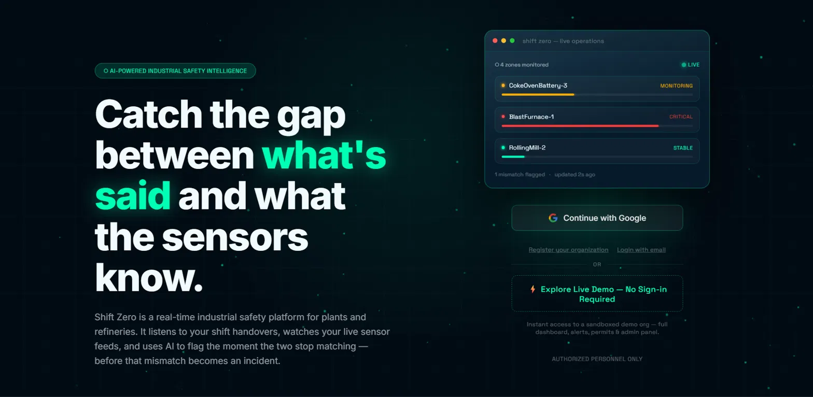
</p>

---

## 📖 Table of Contents

- [What this is](#-what-this-is)
- [The Problem](#-the-problem)
- [Features](#-features)
- [Architecture](#-architecture)
- [The Core Idea — Verbal vs Sensor Mismatch](#-the-core-idea--verbal-vs-sensor-mismatch)
- [Zone & Metric Flexibility](#-zone--metric-flexibility)
- [Product Walkthrough](#-product-walkthrough)
- [Tech Stack](#-tech-stack)
- [Project Structure](#-project-structure)
- [Getting Started](#-getting-started)
- [Environment Variables](#-environment-variables)
- [Database Schema](#-database-schema)
- [API Reference](#-api-reference)
- [Deployment](#-deployment)
- [Live Demo](#-live-demo)

---

## 🧭 What this is

**6,500+ fatal industrial accidents happen every year in India (DGFASLI data)**, and a large share of them cluster in the two hours right around a shift changeover. The root cause is rarely equipment failure — it's a communication failure. The outgoing supervisor writes "sab normal hai, routine hai" while a sensor is already trending toward danger, and nobody cross-checks the two before work continues.

Shift Zero targets exactly that ten-minute window. Every zone in a plant streams live sensor readings and accepts shift-handover notes; an NLP risk-language scorer reads the *tone* of the note (calm vs. alarmed) and a deterministic engine compares it against the *actual* sensor risk trend. When a supervisor sounds calm but the sensors say otherwise, a **Verbal–Sensor Mismatch** alert fires immediately, backed by an AI-generated recommendation grounded in similar past incidents. In parallel, active Permit-to-Work entries are cross-checked against the same live data, so a Hot Work permit sitting in a zone that just crossed a critical gas threshold triggers an instant **Permit Conflict**, not a shrug.

---

## ⚠️ The Problem

<p align="center">
  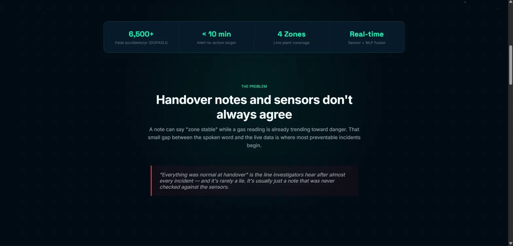
</p>

> *"Everything was normal at handover" is the line investigators hear after almost every incident — and it's rarely a lie. It's usually just a note that was never checked against the sensors.*

A note can say "zone stable" while a gas reading is already trending toward danger. That small, human gap between the spoken word and the live data is where most preventable incidents begin — and it's invisible to a normal SCADA dashboard, because the dashboard only shows numbers, never the story a person told about them.

---

## ✨ Features

<table>
<tr><td width="33%" valign="top">

### 🚨 Detection
- Live sensor streaming per zone over Socket.IO (auto-refresh every few seconds)
- Gemini-scored handover notes (text or voice), compared against live sensor risk
- Verbal–Sensor Mismatch alerts with a 0–100 mismatch score
- RAG-backed recommendations grounded in a corpus of past incidents

</td><td width="33%" valign="top">

### 📋 Compliance & Permits
- Digital Permit-to-Work issuing, tracking and closing
- Automatic conflict detection between an active permit and live zone risk
- One-click Shift Report PDF and DGFASLI-style audit CSV export
- Every handover note and status update permanently linked to the user who filed it

</td><td width="33%" valign="top">

### 🗺️ Operations
- Live geospatial Zone Map, colour-coded by risk (nominal / elevated / critical)
- Sparkline trend charts for temperature and risk, per zone
- Shift roster with on-duty/upcoming/past views and per-zone email alerts
- Team & user management with email-locked invites and role control (Admin/Operator)

</td></tr>
</table>

**Auth & access** — Register an organization or sign in with Google, JWT-based sessions, per-zone role scoping (Admin vs Operator), and a no-login **"Explore Live Demo"** mode that drops anyone straight into a full sandboxed dashboard — alerts, permits and admin panel included.

---

## 🏗️ Architecture

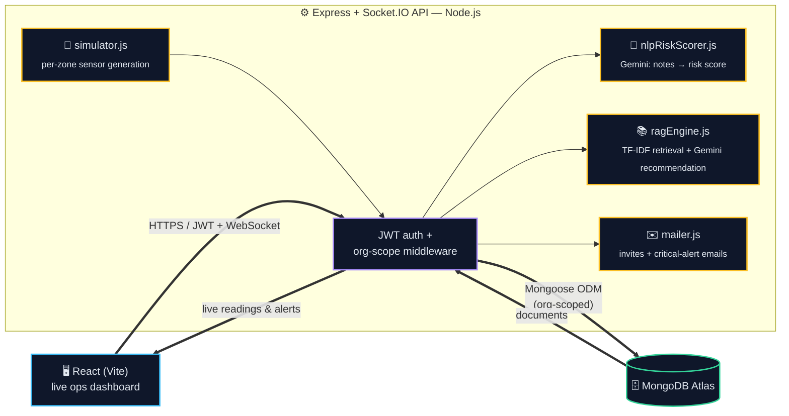
```mermaid
flowchart LR
    classDef client fill:#0f172a,stroke:#38bdf8,stroke-width:2px,color:#e2e8f0
    classDef api fill:#0f172a,stroke:#a78bfa,stroke-width:2px,color:#e2e8f0
    classDef util fill:#0f172a,stroke:#fbbf24,stroke-width:2px,color:#e2e8f0
    classDef db fill:#0f172a,stroke:#34d399,stroke-width:2px,color:#e2e8f0

    FE["🖥️ React (Vite)<br/>live ops dashboard"]:::client

    subgraph Backend [" ⚙️ Express + Socket.IO API — Node.js "]
        direction TB
        API["JWT auth +<br/>org-scope middleware"]:::api
        SIM["📡 simulator.js<br/><sub>per-zone sensor generation</sub>"]:::util
        NLP["🤖 nlpRiskScorer.js<br/><sub>Gemini: notes → risk score</sub>"]:::util
        RAG["📚 ragEngine.js<br/><sub>TF-IDF retrieval + Gemini recommendation</sub>"]:::util
        MAIL["✉️ mailer.js<br/><sub>invites + critical-alert emails</sub>"]:::util
        API --> NLP & RAG & MAIL
        SIM --> API
    end

    DB[("🗄️ MongoDB Atlas")]:::db

    FE == "HTTPS / JWT + WebSocket" ==> API
    API == "live readings & alerts" ==> FE
    API == "Mongoose ODM<br/>(org-scoped)" ==> DB
    DB == "documents" ==> API
```

- **Frontend** — a React (Vite) SPA that pairs a Socket.IO client for live zone data with page trees for Live Operations, Handover, Update Status, Alerts, Permits, Shift Roster, Team, Zone Map, Zones and Users.
- **Backend** — Express + Socket.IO, every protected route behind JWT auth and an organization-scoping check so one company's zones, permits and users can never surface in another company's dashboard.
- **nlpRiskScorer.js** — scores how much a handover note's *language* acknowledges risk (0 = downplays, 1 = clearly flags danger) via Gemini, with a rule-based phrase-matching fallback so a flaky AI call never breaks the live demo.
- **ragEngine.js** — the only place recommendations get written: TF-IDF cosine similarity (via `natural`) retrieves the closest historical incidents, then Gemini phrases a grounded, actionable recommendation citing them — with retry-with-backoff and a non-LLM fallback.
- **simulator.js** — generates sensor readings only for zones an admin has set to `simulated` mode; zones set to `manual` only ever get updated by a real person through the Update Status page.

---

## 🧠 The Core Idea — Verbal vs Sensor Mismatch

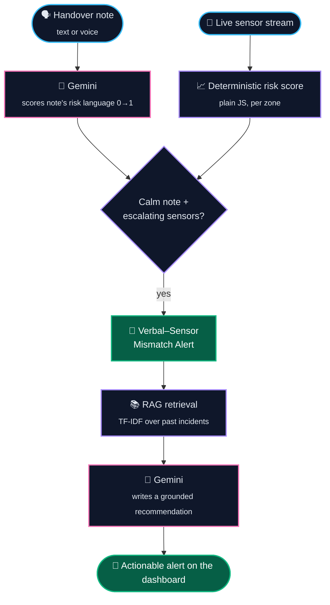
```mermaid
flowchart TD
    classDef input fill:#0f172a,stroke:#38bdf8,color:#e2e8f0,stroke-width:2px
    classDef ai fill:#0f172a,stroke:#f472b6,color:#e2e8f0,stroke-width:2px
    classDef stage fill:#0f172a,stroke:#a78bfa,color:#e2e8f0,stroke-width:2px
    classDef result fill:#065f46,stroke:#10b981,color:#ffffff,stroke-width:2px

    A(["🗣️ Handover note<br/><sub>text or voice</sub>"]):::input --> B["🤖 Gemini<br/><sub>scores note's risk language 0→1</sub>"]:::ai
    C(["📡 Live sensor stream"]):::input --> D["📈 Deterministic risk score<br/><sub>plain JS, per zone</sub>"]:::stage
    B --> E{"Calm note +<br/>escalating sensors?"}:::stage
    D --> E
    E -- yes --> F["🔴 Verbal–Sensor<br/>Mismatch Alert"]:::result
    F --> G["📚 RAG retrieval<br/><sub>TF-IDF over past incidents</sub>"]:::stage
    G --> H["🤖 Gemini<br/><sub>writes a grounded recommendation</sub>"]:::ai
    H --> I(["💬 Actionable alert on the dashboard"]):::result
```

The same live risk score also feeds **Permit-to-Work conflict detection**: if an active permit (e.g. `HOT_WORK`) sits in a zone whose risk has crossed its critical threshold, a Permit Conflict is raised the moment that threshold is crossed — no supervisor has to notice it manually.

---

## 🧩 Zone & Metric Flexibility

Shift Zero isn't hardcoded to one industry's sensors. Each zone is configured with its own set of metrics (gas ppm, temperature, noise, humidity, occupancy — whatever matters), and can run in one of two modes:

- **Simulated** — the backend auto-generates plausible, occasionally escalating readings for demos and testing.
- **Manual** — no auto-generated data at all; readings only ever arrive from a team member via the Update Status page, which feeds the exact same risk/alert engine as real sensor hardware would.

---

## 🖼️ Product Walkthrough

### 1️⃣ Landing

<p align="center">
  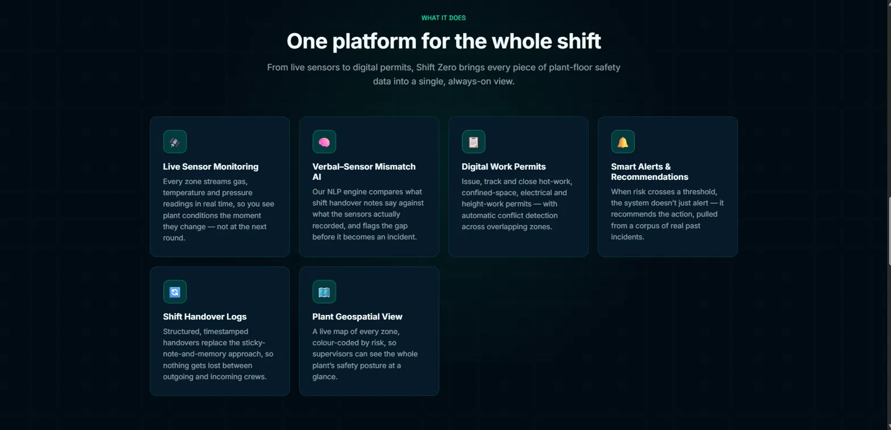
</p>
<p align="center"><em>Live sensor monitoring, verbal–sensor mismatch AI, digital permits and smart alerts — the pillars of the platform.</em></p>

<p align="center">
  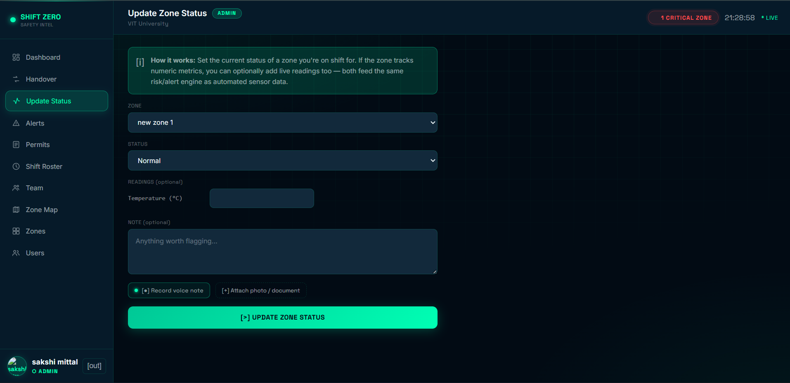
</p>
<p align="center"><em>No new hardware to install — Shift Zero sits on top of the sensors and reporting a plant already has.</em></p>

### 2️⃣ Live Operations Dashboard

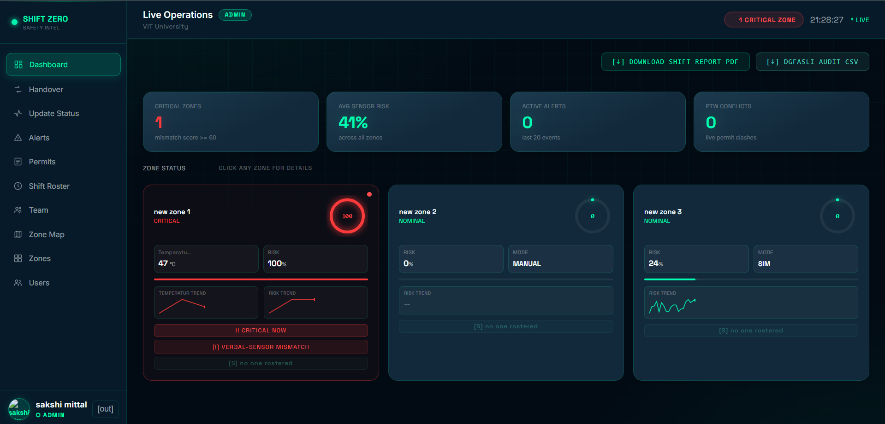
<p align="center"><em>Critical zones, average sensor risk, active alerts and PTW conflicts at a glance, with per-zone temperature and risk sparklines.</em></p>

### 3️⃣ Shift Handover — where the mismatch gets caught

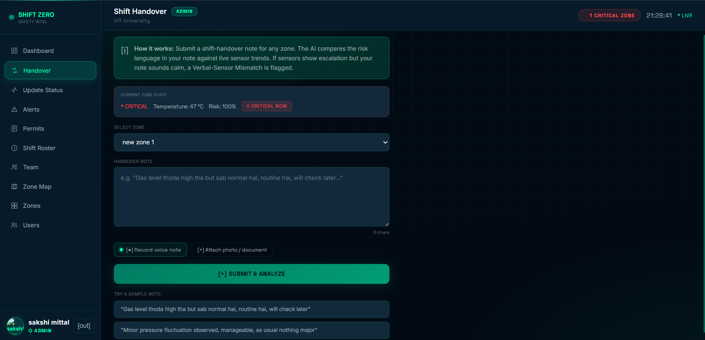
<p align="center"><em>A supervisor submits a note (text or voice); the AI compares its risk language against the zone's live trend and flags a mismatch if they disagree.</em></p>

### 4️⃣ Update Status — manual zones feed the same engine

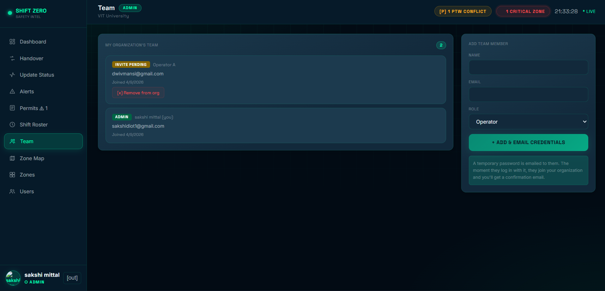

### 5️⃣ Permit to Work — auto-conflict against live risk

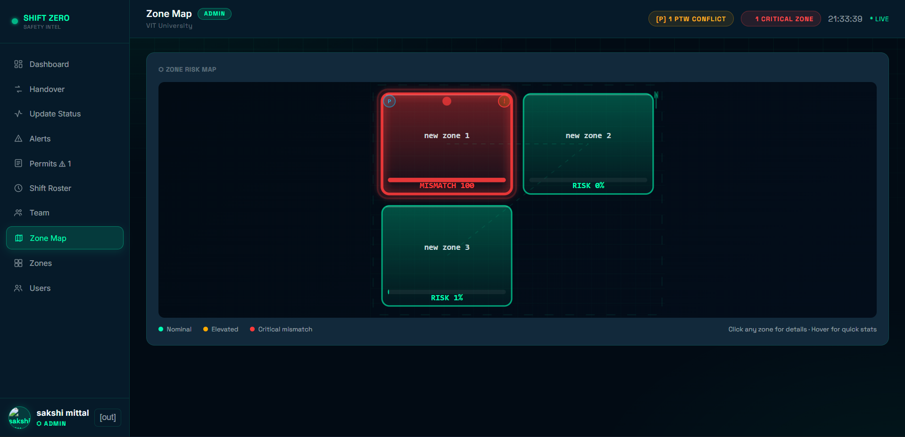
<p align="center"><em>An active Hot Work permit in a zone now at 100% risk is flagged instantly, with the reasoning shown inline.</em></p>

### 6️⃣ Shift Roster & Team

<table>
<tr>
<td width="50%">

**Assign shifts, get emailed on critical mismatches**
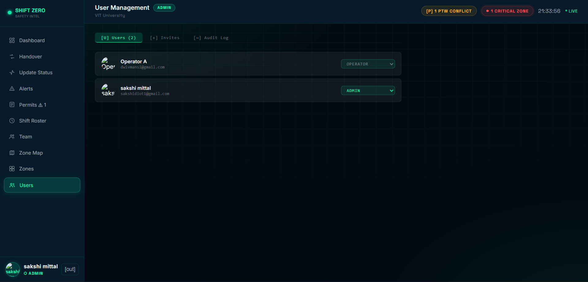
</td>
<td width="50%">

**Email-locked invites for onboarding**

</td>
</tr>
</table>

### 7️⃣ Zone Map & Zone Configuration

<table>
<tr>
<td width="50%">

**Live geospatial risk view**

</td>
<td width="50%">

**Per-industry metric setup — simulated or manual**

</td>
</tr>
</table>

### 8️⃣ Operator view

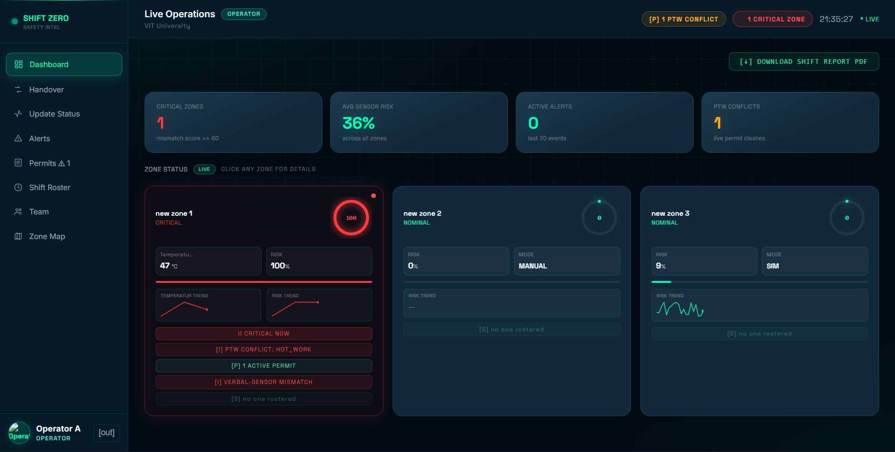
<p align="center"><em>Operators see the same live zone status and can submit handovers, scoped to their role — without admin-only controls.</em></p>

---

## 🧰 Tech Stack

| Layer | Technology |
|---|---|
| Frontend | React 19 (Vite), Socket.IO client, Recharts |
| Backend | Node.js, Express 5, Socket.IO server |
| Database | MongoDB + Mongoose |
| AI | Google Gemini API — handover risk-language scoring, RAG-grounded recommendations |
| Retrieval | TF-IDF cosine similarity over a historical incident corpus (`natural`) |
| Auth | JWT, Google Identity Services (`@react-oauth/google`) |
| Notifications | Nodemailer — invite emails + automatic critical-alert emails to on-duty admins |
| Reports | `pdfkit` — one-click shift report PDF + DGFASLI-style audit CSV |
| Hosting | Render (backend + frontend), MongoDB Atlas |

---

## 📁 Project Structure

```
shift-zero/
├── backend/
│   ├── models/           # Company, User, Zone, SensorReading, HandoverLog, Permit, Shift, Alert, Invite, AuditLog
│   ├── middleware/        # JWT auth guard, admin-role guard
│   ├── routes/            # authRoutes, teamRoutes, zoneRoutes
│   ├── utils/             # password hashing helpers
│   ├── simulator.js       # per-zone sensor reading generation (simulated zones only)
│   ├── nlpRiskScorer.js   # Gemini-based handover risk-language scorer + fallback
│   ├── ragEngine.js       # TF-IDF retrieval + Gemini recommendation generation
│   ├── incidentCorpus.js  # historical/synthetic incident records used for retrieval
│   ├── mailer.js          # invite + critical-alert emails
│   ├── db.js
│   ├── server.js           # Express app, Socket.IO server, all core routes (handover, state, alerts, permits, shifts, users, reports, health)
│   └── package.json
├── frontend/
│   ├── src/
│   │   ├── assets/
│   │   ├── App.jsx
│   │   └── main.jsx
│   ├── public/
│   └── package.json
└── README.md
```

---

## 🚀 Getting Started

### Prerequisites
- Node.js 18+
- A MongoDB connection string (Atlas free tier works fine)
- A Google Gemini API key
- (Optional) A Google OAuth Client ID for Google Sign-In
- (Optional) SMTP credentials (e.g. a Gmail app password) for invite/alert emails

### 1. Backend

```bash
cd backend
npm install
cp .env.example .env      # fill in your own values
npm run dev                # or: npm start
```

API runs on `http://localhost:5000` by default.

### 2. Frontend

```bash
cd frontend
npm install
cp .env.example .env      # fill in your own values
npm run dev
```

Frontend runs on the default Vite port and talks to the backend via `VITE_BACKEND_URL`.

---

## 🔐 Environment Variables

**`backend/.env`**

| Variable | Description |
|---|---|
| `MONGODB_URI` | MongoDB connection string |
| `JWT_SECRET` | Secret used to sign auth tokens |
| `PORT` | Port the API listens on |
| `GEMINI_API_KEY` | Google Gemini API key, powers handover scoring + RAG recommendations |
| `GEMINI_API_KEY_BACKUP` | Optional secondary Gemini key used if the primary is rate-limited |
| `EMAIL_USER` / `EMAIL_PASS` | SMTP credentials for invite emails and critical-alert notifications |
| `FRONTEND_URL` | Deployed frontend URL, used to build invite links |

**`frontend/.env`**

| Variable | Description |
|---|---|
| `VITE_BACKEND_URL` | `http://localhost:5000` locally; deployed backend URL in production |
| `VITE_GOOGLE_CLIENT_ID` | Google OAuth Client ID for Google Sign-In — safe to expose publicly |

---

## 🗄️ Database Schema

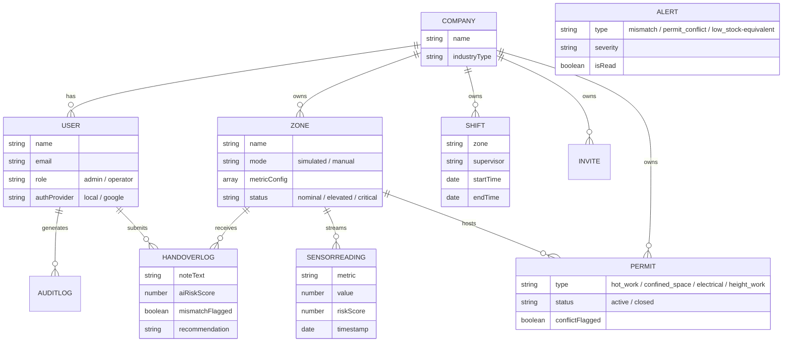
```mermaid
erDiagram
    COMPANY ||--o{ USER : has
    COMPANY ||--o{ ZONE : owns
    COMPANY ||--o{ PERMIT : owns
    COMPANY ||--o{ SHIFT : owns
    COMPANY ||--o{ INVITE : owns
    ZONE ||--o{ SENSORREADING : streams
    ZONE ||--o{ HANDOVERLOG : receives
    ZONE ||--o{ PERMIT : hosts
    USER ||--o{ HANDOVERLOG : submits
    USER ||--o{ AUDITLOG : generates

    COMPANY {
        string name
        string industryType
    }
    USER {
        string name
        string email
        string role "admin / operator"
        string authProvider "local / google"
    }
    ZONE {
        string name
        string mode "simulated / manual"
        array metricConfig
        string status "nominal / elevated / critical"
    }
    SENSORREADING {
        string metric
        number value
        number riskScore
        date timestamp
    }
    HANDOVERLOG {
        string noteText
        number aiRiskScore
        boolean mismatchFlagged
        string recommendation
    }
    PERMIT {
        string type "hot_work / confined_space / electrical / height_work"
        string status "active / closed"
        boolean conflictFlagged
    }
    SHIFT {
        string zone
        string supervisor
        date startTime
        date endTime
    }
    ALERT {
        string type "mismatch / permit_conflict / low_stock-equivalent"
        string severity
        boolean isRead
    }
```

| Collection | Purpose |
|---|---|
| **Company** | One organization/plant. Every other collection is scoped to it. |
| **User** | Belongs to exactly one company; `admin` or `operator` role, `local` or `google` auth. |
| **Zone** | A monitored area with its own metric configuration and mode (`simulated`/`manual`). |
| **SensorReading** | One reading for one metric in one zone — the row every risk score is computed from. |
| **HandoverLog** | A shift-handover note, its AI risk score, and whether it triggered a mismatch — permanently linked to the user who filed it. |
| **Permit** | A Permit-to-Work entry, auto-checked against live zone risk for conflicts. |
| **Shift** | A roster assignment — who is on duty for which zone, and when. |
| **Alert** | A fired mismatch or conflict alert, read/unread. |
| **Invite** | An email-locked pending invite into a company. |
| **AuditLog** | Accountability trail of who did what, when. |

---

## 📡 API Reference

Base URL: `/api`. All routes except `auth/login`, `auth/register-org`, `auth/google` and `auth/demo` require a `Bearer` JWT.

<details>
<summary><strong>Auth — <code>/api/auth</code></strong></summary>

| Method | Route | Access | Description |
|---|---|---|---|
| POST | `/register-org` | Public | Register a company + admin account |
| POST | `/login` | Public | Email/password login |
| POST | `/google` | Public | Google Sign-In (login or signup) |
| POST | `/demo` | Public | Enter the no-login sandboxed demo |
| POST | `/change-password` | Authenticated | Change the current user's password |
| POST | `/invite` | Admin | Send an email-locked invite |
| GET | `/invites` | Admin | List pending invites |
| DELETE | `/invites/:token` | Admin | Revoke a pending invite |
| GET | `/audit` | Admin | Organization audit log |

</details>

<details>
<summary><strong>Zones — <code>/api/zones</code></strong></summary>

| Method | Route | Access | Description |
|---|---|---|---|
| GET | `/` | Authenticated | List zones |
| POST | `/` | Admin | Create a zone (metrics + mode) |
| PATCH | `/:id` | Admin | Update a zone's configuration |
| DELETE | `/:id` | Admin | Delete a zone |
| POST | `/:id/status` | Authenticated | Submit a manual status/reading update for a zone |

</details>

<details>
<summary><strong>Team — <code>/api/team</code></strong></summary>

| Method | Route | Access | Description |
|---|---|---|---|
| GET | `/` | Authenticated | List the organization's team |
| POST | `/members` | Admin | Add a team member directly |
| PATCH | `/members/:id/remove` | Admin | Remove a member from the org |

</details>

<details>
<summary><strong>Handover, State & Alerts — <code>/api</code></strong></summary>

| Method | Route | Description |
|---|---|---|
| POST | `/handover` | Submit a shift-handover note → Gemini scores it → compared against live risk → mismatch flagged if needed |
| GET | `/handover` | List past handover notes |
| GET | `/state` | Current live state of every zone |
| GET | `/history/:zone` | Historical sensor readings for one zone |
| GET | `/alerts` | List alerts |

</details>

<details>
<summary><strong>Permits — <code>/api/permits</code></strong></summary>

| Method | Route | Access | Description |
|---|---|---|---|
| GET | `/` | Authenticated | List permits |
| POST | `/` | Admin | Issue a new permit |
| PATCH | `/:id/close` | Admin | Close a permit |

</details>

<details>
<summary><strong>Shifts — <code>/api/shifts</code></strong></summary>

| Method | Route | Access | Description |
|---|---|---|---|
| GET | `/` | Authenticated | List roster entries |
| GET | `/on-duty` | Authenticated | Who is currently on duty, per zone |
| POST | `/` | Admin | Assign a shift |
| PATCH | `/:id/end` | Admin | End a shift |

</details>

<details>
<summary><strong>Users, Companies & Reports — <code>/api</code></strong></summary>

| Method | Route | Access | Description |
|---|---|---|---|
| GET | `/users` | Admin | List users in the organization |
| PATCH | `/users/:id/role` | Admin | Change a user's role |
| GET | `/companies` | Authenticated | Company details |
| GET | `/report/pdf` | Authenticated | Download a shift report PDF |
| GET | `/report/csv` | Admin | Download a DGFASLI-style audit CSV |
| GET | `/health` | Public | Liveness check |

</details>

**Real-time** — the frontend also holds a persistent Socket.IO connection to the backend for live sensor readings, zone status changes and alert pushes, so the dashboard updates without polling.

---

## ☁️ Deployment

- **Backend** → Render (root directory `backend`; build: `npm install`; start: `npm start`)
- **Frontend** → Render Static Site (root directory `frontend`; build: `npm run build`)
- **Database** → MongoDB Atlas (free tier)

Set `FRONTEND_URL` on the backend to your deployed frontend URL, and `VITE_BACKEND_URL` on the frontend to your deployed backend URL.

---

## 🌐 Live Demo

| | Link |
|---|---|
| **Frontend** | [shift-zero-frontend.onrender.com](https://shift-zero-frontend.onrender.com) |
| **Backend API** | [shift-zero-backend.onrender.com](https://shift-zero-backend.onrender.com) |

> ⏳ Hosted on Render's free tier — the backend spins down after inactivity, so the first request may take 30–60s to wake up. That's expected, not a bug. Use **"Explore Live Demo"** on the landing page for instant, no-signup access to a full sandboxed dashboard.